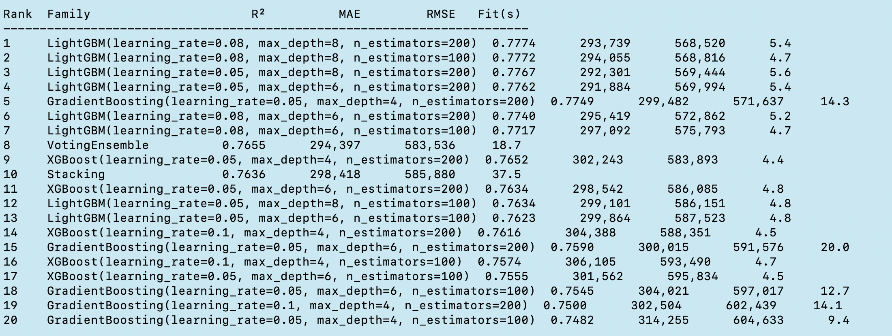
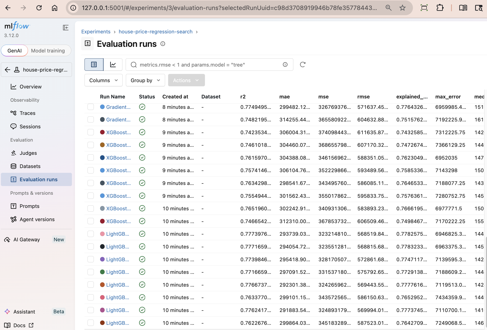
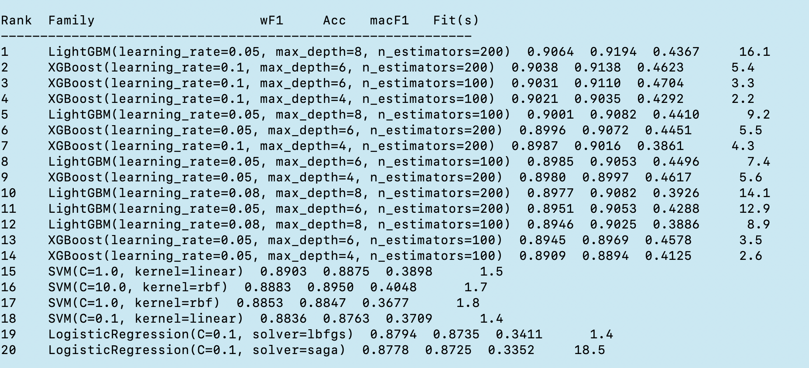
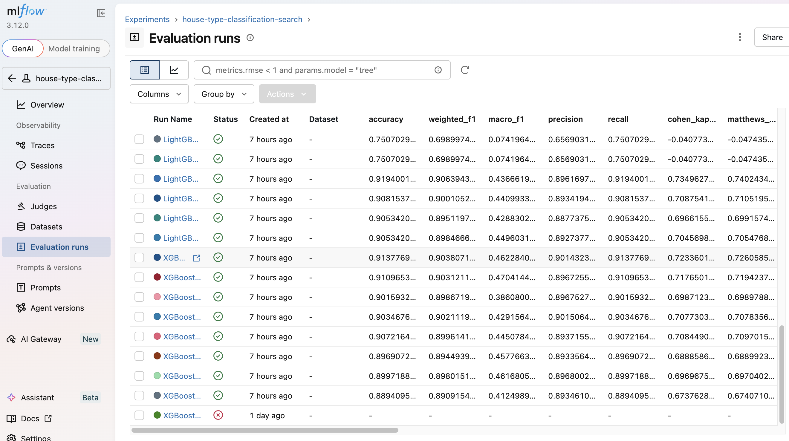
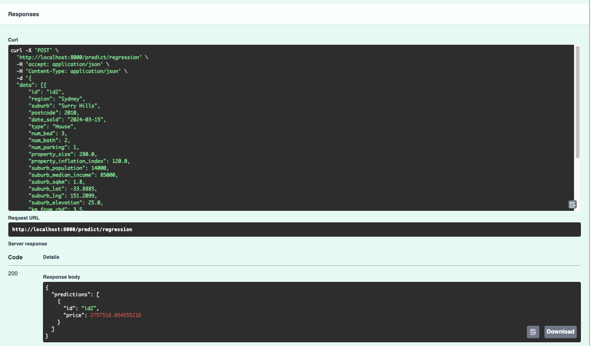
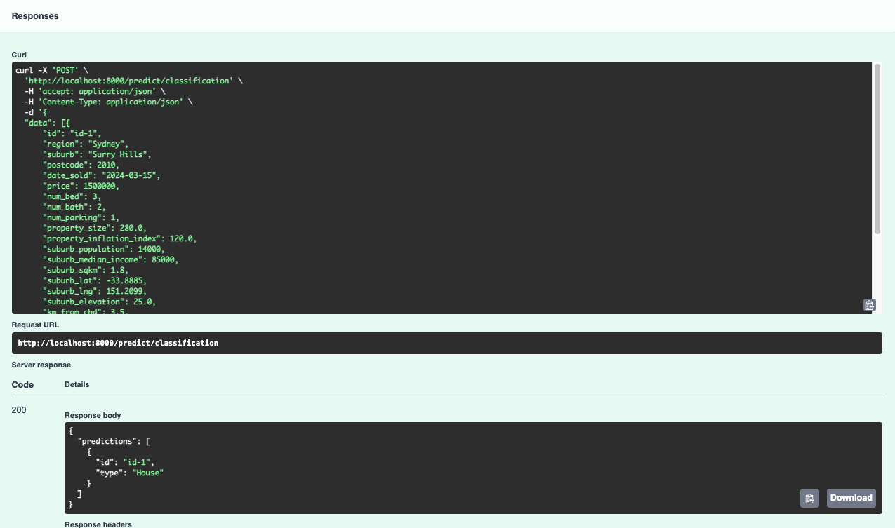

# Australian House Price & Type Prediction

An end-to-end machine learning system that predicts residential property **sale price** (regression) and **property category** (classification) from suburb and property features across the Sydney market.

The project spans the full ML lifecycle: exploratory feature engineering, reproducible sklearn pipelines, a production-ready FastAPI inference layer, and a configurable experiment framework that sweeps 17 model families across 109 hyperparameter combinations — all tracked with MLflow.

---

## Architecture

```
┌─────────────────────────────────────────────────────────────┐
│                        backend/                             │
│                                                             │
│   app/                         experiments/                 │
│   ├── api/                     ├── candidates/              │
│   │   └── routes/              │   ├── regression.yaml  ←── edit to add models
│   │       ├── predict.py       │   ├── classification.yaml  │
│   │       └── health.py        │   └── loader.py            │
│   ├── pipelines/               ├── metrics.py               │
│   │   ├── regression.py        ├── runner.py                │
│   │   └── classification.py   ├── run_regression.py        │
│   ├── training/                └── run_classification.py   │
│   ├── transformer/                                          │
│   ├── io/  (Azure Blob + MLflow)                           │
│   └── core/ (Settings, config)                             │
└─────────────────────────────────────────────────────────────┘
```

**One-way dependency boundary:** `experiments/ → app/`, never `app/ → experiments/`. Experiments are a developer tool; the FastAPI application never imports from them.

---

## Models

| Task | Production Model | Target | Metric |
|---|---|---|---|
| Regression | LightGBM wrapped in `TransformedTargetRegressor(log1p)` | `price` (AUD) | R² |
| Classification | XGBoost with inverse-frequency class weighting | `type` (House / Apartment / Duplex / …) | Weighted F1 |

Both pipelines share a common preprocessing stage built from composable sklearn transformers:

```
zero→NaN imputation
  → date decomposition (year, month, season, days-since)
  → log-scaling of right-skewed columns (property_size, km_from_cbd, suburb_population, …)
  → transport-time binning (short / medium / long)
  → task-specific feature engineering
  → correlation filter (ρ > 0.95 dropped)
  → variance filter (σ² < 0.01 dropped)
  → KNN / mean imputation → StandardScaler → OneHotEncoder
  → model
```

Regression adds geo-clustering features and cyclical month encoding. Classification adds duplex-likelihood scoring from bath/bed/parking ratios.

---

## Experiment Framework

The experiment runner automates the model selection process: define candidates in YAML, run one command, compare every result in MLflow.

```bash
cd backend/

# Sweep 12 regression families across 72 hyperparameter combinations
uv run python -m experiments.run_regression \
    --train-data ../data/train.csv \
    --test-data  ../data/test.csv \
    -vv

# Sweep 5 classification families across 37 hyperparameter combinations
uv run python -m experiments.run_classification \
    --train-data ../data/train.csv \
    --test-data  ../data/test.csv \
    -vv

# Open MLflow UI to compare all runs
uv run mlflow ui \
    --backend-store-uri "sqlite:////$(pwd)/mlflow.db" \
    --port 5001
```

**To add a model or tune a grid — edit the YAML, no code change needed:**

```yaml
# backend/experiments/candidates/regression.yaml
candidates:
  - family: LightGBM
    class: lightgbm.LGBMRegressor
    defaults:
      verbosity: -1
      random_state: 42
    param_grid:
      n_estimators: [100, 200]
      max_depth: [6, 8]
      learning_rate: [0.05, 0.08]
```

Every MLflow run captures: model family, all hyperparameters, full metrics (R², MAE, RMSE, … or accuracy, weighted F1, per-class F1, …), fit time, and the YAML config file as an artifact — so any result is fully reproducible.

### Regression results — 72 runs across 12 families


*Terminal leaderboard: all 72 runs ranked by R², printed at completion.*


*MLflow experiment view: sortable by any metric, filterable by `tags.model_family`.*

### Classification results — 37 runs across 5 families


*Terminal leaderboard: all 37 runs ranked by weighted F1.*


*MLflow experiment view with per-class F1 metrics for each property type.*

---

## Inference API

A FastAPI application serves the trained models over REST. Models are loaded from Azure Blob Storage on startup (production) or from a local `models/` directory (development).

```bash
# Development mode — loads models from models/ directory
cd backend/
uv run python -m app.serve --mode local

# Production mode — pulls artifacts from Azure Blob Storage
uv run python -m app.serve --mode azure
```

### Endpoints

```
POST /predict/regression      → { predictions: [{ id, price }] }
POST /predict/classification  → { predictions: [{ id, type }] }
GET  /health                  → { status: "ok" }
```

**Example — predict sale price:**

```bash
curl -X POST http://localhost:8000/predict/regression \
  -H "Content-Type: application/json" \
  -d '{
    "data": [{
      "id": "prop_001",
      "num_bed": 3, "num_bath": 2, "num_parking": 1,
      "property_size": 450,
      "suburb": "Surry Hills", "postcode": 2010,
      "suburb_lat": -33.889, "suburb_lng": 151.211,
      "date_sold": "2023-06-15",
      ...
    }]
  }'
```

```json
{
  "predictions": [
    { "id": "prop_001", "price": 1482000.0 }
  ]
}
```


*FastAPI `/predict/regression` response for a sample Sydney property.*


*FastAPI `/predict/classification` response showing predicted property type.*

---

## Training

```bash
# Train both models and save artifacts
cd backend/
uv run python main.py ../data/train.csv ../data/test.csv -v
```

Outputs `regression.csv` and `classification.csv` with predictions, and persists model artifacts for the API to load. When MLflow tracking is enabled (`MLFLOW_ENABLED=true`), the production run is also logged to the `house-price-regression` / `house-type-classification` experiments.

---

## Project Structure

```
house-prediction-ML/
├── backend/
│   ├── app/
│   │   ├── api/routes/          REST endpoints (predict, health)
│   │   ├── core/                Settings (pydantic-settings, .env)
│   │   ├── io/                  Azure Blob loader, MLflow tracker
│   │   ├── pipelines/           sklearn Pipeline constants + factory functions
│   │   ├── schemas/             Pydantic request / response models
│   │   ├── training/            regression_main(), classification_main()
│   │   └── transformer/         Custom sklearn transformers
│   ├── experiments/
│   │   ├── candidates/          YAML configs + dataclasses + YAML loader
│   │   ├── metrics.py           evaluate_regression(), evaluate_classification()
│   │   ├── runner.py            RegressionRunner, ClassificationRunner
│   │   ├── run_regression.py    CLI entry point
│   │   └── run_classification.py
│   └── pyproject.toml
├── data/
│   ├── train.csv
│   └── test.csv
├── assets/                      Screenshots for documentation
└── main.py                      Original single-file training script
```

---

## Engineering Challenges & Lessons Learned

Real issues encountered during development, documented for future reference.

### 1. sklearn `fit_transform()` causes duplicate log lines

**Problem:** Custom transformers that log inside `transform()` produced 6× duplicate log entries per training run. sklearn's `fit_transform()` calls `fit()` then `transform()` internally, and `predict()` also calls `transform()` — so every run triggered the log three times each for fit and predict.

**Fix:** Move all log calls into `fit()` only. `transform()` must stay side-effect-free.

---

### 2. MLflow SQLite URI — relative vs absolute path

**Problem:** `sqlite:///mlflow.db` is relative to the process CWD. Training run from `backend/` and `mlflow ui` started from the project root wrote to two different database files. The UI showed only the "Default" experiment with no runs.

**Fix:** Anchor the path at import time using `Path(__file__).parents[N]` to resolve to `backend/` regardless of invocation directory. Four slashes for absolute: `sqlite:////absolute/path/mlflow.db`.

```python
_BACKEND_DIR = Path(__file__).parents[2]  # always resolves to backend/
uri = f"sqlite:///{_BACKEND_DIR}/mlflow.db"
```

---

### 3. MLflow 2.x → 3.x breaking API changes

**Problem:** MLflow 3.x renamed `artifact_path=` to `name=` in `log_model()` and changed artifact storage layout from `artifacts/<run_id>/model` to `models/m-<uuid>/`. Code written against 2.x silently produced wrong artifact URIs; manual path construction was broken.

**Fix:** Capture the return value of `log_model()` and use `model_info.model_uri` directly — never construct the path manually.

```python
model_info = mlflow.sklearn.log_model(pipeline, name="regression_20240101_120000")
mlflow.register_model(model_info.model_uri, "house-price-regression")
```

---

### 4. MLflow metric name validation rejects special characters

**Problem:** Property type labels like `"New House & Land"` contain `&`, which MLflow rejects in metric names (`mlflow.exceptions.MlflowException: Invalid value "f1_New House & Land"`). The error message reports the batch index, not the key name, making it hard to diagnose.

**Fix:** Sanitize class labels before using them as metric keys, replacing any character outside `[a-zA-Z0-9_\-. :/]` with `_`.

```python
_INVALID_METRIC_CHARS = re.compile(r"[^a-zA-Z0-9_\-. :/]")
key = f"f1_{_INVALID_METRIC_CHARS.sub('_', class_label)}"
```

---

### 5. `PandasColumnTransform` crashed on `None` values with `np.log1p`

**Problem:** `np.log1p` raised `AttributeError: 'NoneType' object has no attribute 'log1p'` when columns contained `None` (not `NaN`). pandas `.apply()` passes Python `None` through without converting to `NaN` first.

**Fix:** Cast columns to `float` before applying the function, which converts `None` → `NaN` implicitly. `np.log1p(NaN)` returns `NaN` safely.

---

### 6. `StandardScaler` received 0 samples from clustering features

**Problem:** `CustomRegressionFeatures.transform()` called `.dropna()` on clustering feature columns before fitting the scaler. When all clustering features were `None`/`NaN` in the request payload, `dropna()` removed every row, leaving 0 samples and crashing `StandardScaler`.

**Fix:** The API caller must supply all required feature columns. Missing clustering features (`suburb_lat`, `suburb_lng`, `suburb_sqkm`, etc.) are a schema contract, not a case to handle silently.

---

### 7. Classification holdout split loses rare classes

**Problem:** A standard 80/20 train/validation split on the imbalanced dataset left only ~4 samples of `Studio` (total: 5) in the training fold, producing models that never predicted that class and inflating accuracy while collapsing per-class F1.

**Fix:** Train on the full `train.csv`, evaluate on the separate `test.csv` which has ground-truth labels. No holdout split for classification. Rare classes are handled via inverse-frequency sample weights instead.

---

### 8. `classify__sample_weight` routing through sklearn Pipeline

**Problem:** Passing `sample_weight` to a classifier wrapped inside a `Pipeline` requires using the double-underscore step-name prefix: `pipeline.fit(X, y, classify__sample_weight=weights)`. Using the wrong step name silently ignores the weights with no warning.

**Fix:** The classification pipeline step name is always `"classify"` (both in `PIPELINE_CLASSIFICATION` and `build_classification_pipeline()`), making the call site predictable: `classify__sample_weight=weights`.

---

## Tech Stack

| Layer | Technology |
|---|---|
| ML framework | scikit-learn, LightGBM, XGBoost |
| API | FastAPI, Uvicorn, Pydantic v2 |
| Experiment tracking | MLflow 3.x (SQLite backend) |
| Artifact storage | Azure Blob Storage |
| Config | pydantic-settings, `.env` |
| Dependency management | uv, pyproject.toml |
| Python | 3.13 |

---

## Setup

```bash
# Install dependencies
cd backend/
uv sync

# Copy and fill in environment variables
cp .env.example .env

# Train models
uv run python main.py ../data/train.csv ../data/test.csv -v

# Start API server
uv run python -m app.serve --mode local
```

**Environment variables (`.env`):**

```env
# Azure Blob Storage (production)
AZURE_STORAGE_CONNECTION_STRING=...
AZURE_STORAGE_CONTAINER=models

# MLflow tracking (optional)
MLFLOW_ENABLED=false
MLFLOW_TRACKING_URI=          # default: sqlite:///backend/mlflow.db
MLFLOW_REGISTER_MODELS=false
```
